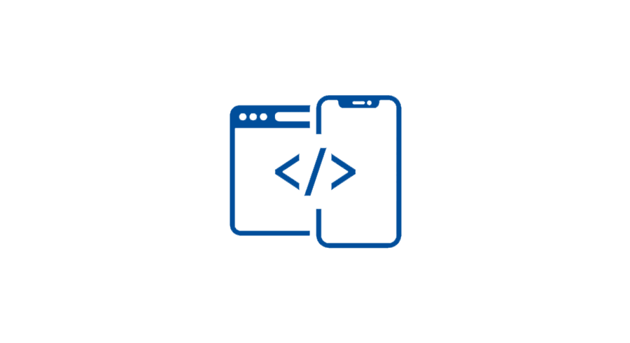
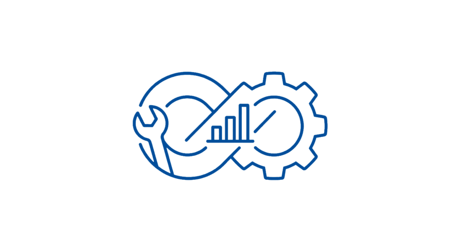

# OKZGN | Platform Engineering & Software Development Solutions.

Designing and architecting scalable, efficient software, web apps and systems. Building tools, frameworks, and core infrastructures.

---

## Services
Providing high-performance technological solutions for businesses and enterprises.

### Web & Mobile Development

*   **Custom Web Design:** Modern, consistent, and user-centric interfaces built from scratch or using frameworks like Tailwind.
*   **High-Performance Frontend:** Fast, lightweight, and responsive interfaces (HTML5, CSS3, JavaScript, Angular).
*   **Scalable Backend:** Robust server-side programming designed to handle everything from low to high-traffic loads (Node.js, Go, PHP).
*   **Cross-Device Compatibility:** Optimized experiences for mobile, tablet, and desktop.
*   **Mobile Apps:** Cost-effective, high-quality mobile solutions (Ionic, PWA) for Android and iOS.
*   **Feature Integration:** CDN implementation, GPS, databases (Parse, Redis, SQLite), secure authentication, custom APIs and SEO optimization.

[**Get a Quote**](https://wa.me/593979522180)

---

### Infrastructure & Hosting

*   **Domain Management:** Full registration and configuration of your web address.
*   **High-Performance Hosting:** Secure, fast, and reliable hosting for systems, applications, and websites.
*   **Professional Server Solutions:** Powerful, modern infrastructure tailored to your needs (Cloud, VPS, Bare Metal).
*   **Security First:** Advanced protection against DDoS and brute-force attacks included, mitigating top OWASP security vulnerabilities.
*   **SSL & DNS:** Expert management of certificates and DNS records to ensure trust and connectivity.

[**Learn More**](https://wa.me/593979522180)

---

### Optimization & DevOps

*   **Server Administration:** End-to-end maintenance of Linux environments (Bash, SSH, Docker, Express, Echo, Nginx).
*   **Data Access Control:** Secure management and access control for your servers, applications, and content.
*   **Future-Proofing:** Periodic updates to migrate obsolete components to efficient, modern or serverless architectures.
*   **Ongoing Support:** Technical assistance to ensure your systems remain fast and stable over time.

[**Contact Support**](https://wa.me/593979522180)

---

## Get in Touch

**Elías Francisco Alvarado Soshina**

[**Contact Assistant on WhatsApp**](https://wa.me/593979522180)

---
*2026 © OKZGN. All rights reserved.*
